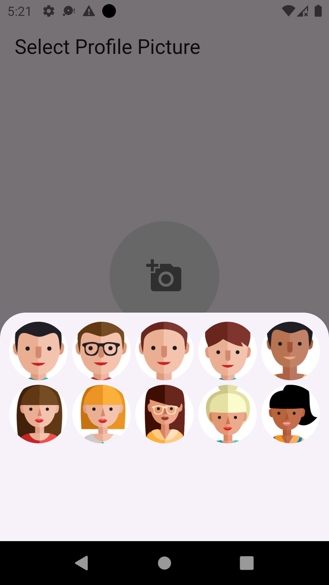

# Avatar Picker Flutter App

A Flutter app that allows users to **select a profile picture** from the **camera, gallery**, or **choose from 10 default avatars**.

## Features
✅ Pick an image from the **Camera**  
✅ Select an image from the **Gallery**  
✅ Choose from **10 predefined avatars**  
✅ Display the selected image in a `CircleAvatar`  
✅ Uses `ListView` to prevent layout overflow issues  

---

## 📸 Screenshots
| Camera & Gallery Selection | Avatar Selection |
|---------------------------|-----------------|
|  |  |

*(Make sure to add actual screenshots in the `assets/screenshots/` folder.)*

---

## 🛠 Installation

### 1️⃣ **Clone the Repository**
```sh
git clone https://github.com/your-repo/avatar_picker_flutter.git
cd avatar_picker_flutter
```

### 2️⃣ **Install Dependencies**
Run the following command:
```sh
flutter pub get
```

### 3️⃣ **Add Required Assets**
Ensure you have **10 avatar images** stored inside `assets/` and declare them in `pubspec.yaml`:
```yaml
flutter:
  assets:
    - assets/avatar_0.png
    - assets/avatar_1.png
    - assets/avatar_2.png
    - assets/avatar_3.png
    - assets/avatar_4.png
    - assets/avatar_5.png
    - assets/avatar_6.png
    - assets/avatar_7.png
    - assets/avatar_8.png
    - assets/avatar_9.png
```

---

## 📌 Usage

1️⃣ **Run the app**
```sh
flutter run
```

2️⃣ **Tap on the profile picture**  
3️⃣ **Choose an option:**
   - 📷 Take a photo using **Camera**
   - 🎼 Pick an image from **Gallery**
   - 👤 Select an **Avatar**  
4️⃣ **See your selected picture displayed!**

---

## 🌧 Project Structure

```
lib/
│── main.dart             # Main entry point
│── avatar_picker.dart    # Profile picture picker UI
assets/
│── avatar_0.png
│── avatar_1.png
│── avatar_2.png
│── ...
pubspec.yaml              # Flutter dependencies & assets
```

---

## 🛠 Dependencies

| Package | Description |
|---------|------------|
| [image_picker](https://pub.dev/packages/image_picker) | Allows picking images from camera & gallery |

To install dependencies:
```sh
flutter pub get
```

---

## 🤝 Contributing

1. Fork the repo 🍔  
2. Create your feature branch (`git checkout -b feature-new`)  
3. Commit your changes (`git commit -m "Added new feature"`)  
4. Push to the branch (`git push origin feature-new`)  
5. Open a Pull Request! 🚀  

---

## 🐟 License
This project is licensed under the MIT License - see the [LICENSE](LICENSE) file for details.

---

### 🎯 **Author**
Developed by **[Your Name](https://github.com/your-profile)**  
💼 Contact: your@email.com

---

🚀 **Happy Coding!** 🎉
